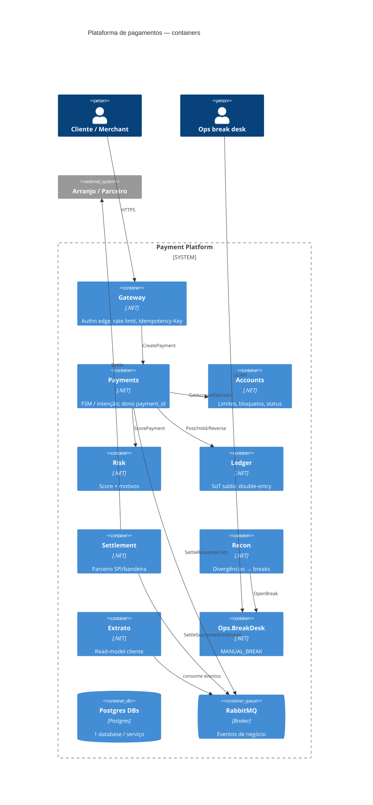

# C4 — Container (rascunho)

```mermaid
C4Container
    title Plataforma de pagamentos — containers

    Person(client, "Cliente / Merchant")
    Person(ops, "Ops break desk")

    System_Boundary(platform, "Payment Platform") {
        Container(gateway, "Gateway", ".NET", "Authn edge, rate limit, Idempotency-Key")
        Container(payments, "Payments", ".NET", "FSM / intenção; dono payment_id")
        Container(accounts, "Accounts", ".NET", "Limites, bloqueios, status")
        Container(risk, "Risk", ".NET", "Score + motivos")
        Container(ledger, "Ledger", ".NET", "SoT saldo; double-entry")
        Container(settlement, "Settlement", ".NET", "Parceiro SPI/bandeira")
        Container(recon, "Recon", ".NET", "Divergências → breaks")
        Container(extrato, "Extrato", ".NET", "Read-model cliente")
        Container(opsdesk, "Ops.BreakDesk", ".NET", "MANUAL_BREAK")
        ContainerDb(dbs, "Postgres DBs", "Postgres", "1 database / serviço")
        ContainerQueue(bus, "RabbitMQ", "Broker", "Eventos de negócio")
    }

    System_Ext(partner, "Arranjo / Parceiro")

    Rel(client, gateway, "HTTPS")
    Rel(gateway, payments, "CreatePayment")
    Rel(payments, accounts, "GetAccountDecision")
    Rel(payments, risk, "ScorePayment")
    Rel(payments, ledger, "Post/Hold/Reverse")
    Rel(payments, bus, "SettleRequested etc.")
    Rel(settlement, partner, "Settle")
    Rel(settlement, bus, "SettleSucceeded/Unknown")
    Rel(recon, opsdesk, "OpenBreak")
    Rel(ops, opsdesk, "UI/API")
    Rel(extrato, bus, "consome eventos")
```

Sync no caminho crítico de authorize: Gateway → Payments → Accounts/Risk → Ledger.  
Settlement / Extrato / Recon são async via broker.
